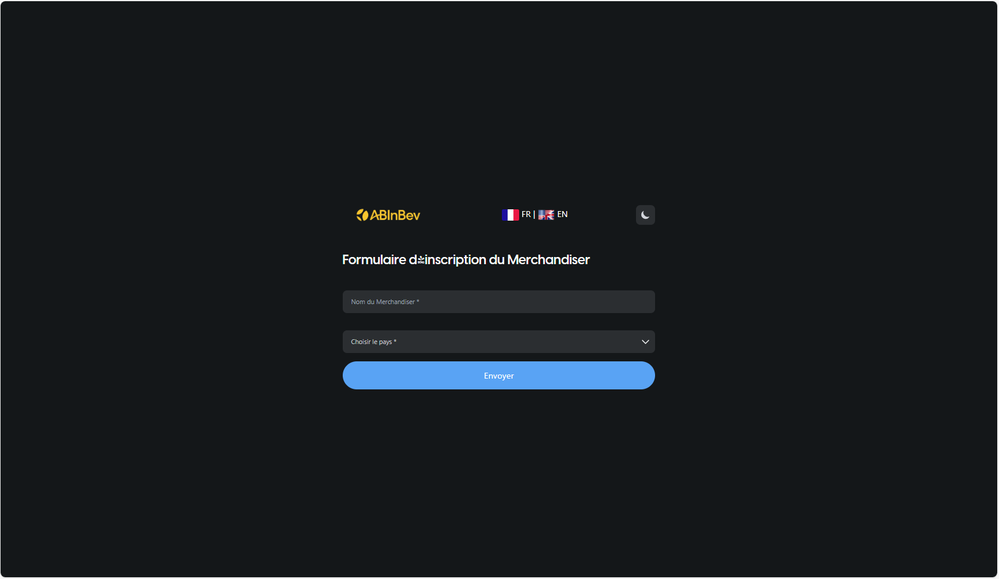
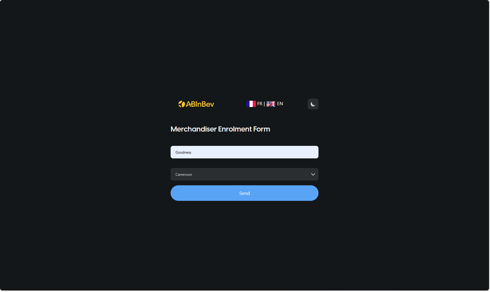
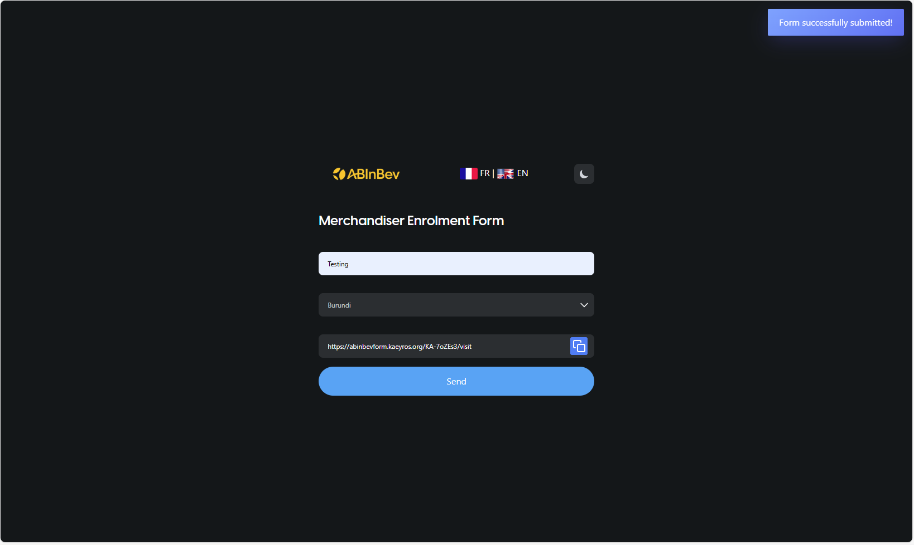
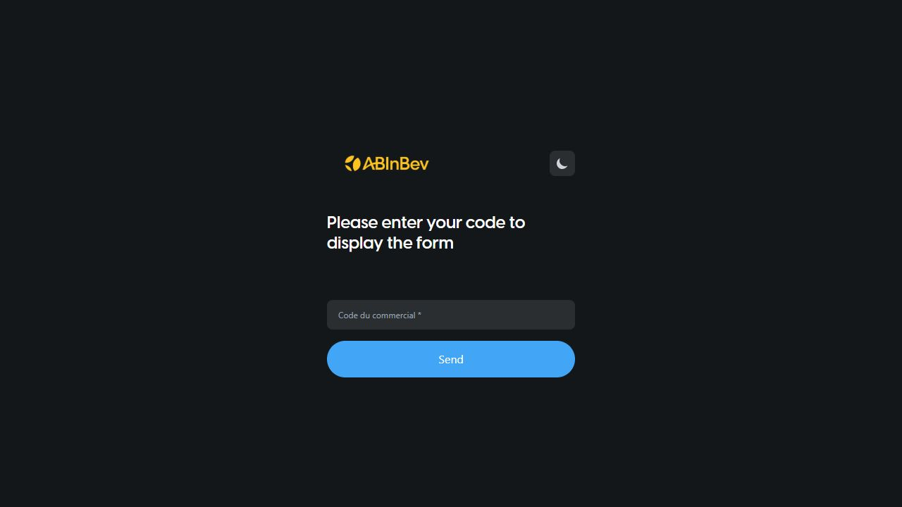

Merchandiser Enrollment
=======================

To start using the ABInBev POC Visit platform, you must first enroll as a merchandiser. This process generates a unique link that you will use to conduct visits.

Access the Enrollment Form
--------------------------

Go to the following URL: ``https://kaeyros4abbev-form.kaeyros.org/sales-representative/form``

Fill in your **name** and select your **country** from the dropdown. Then click **Send**.

After submission, a confirmation message appears with a personalised link:

Example: ``https://kaeyros4abbev-form.kaeyros.org/KA-7oZEe3/visit``

Copy this link. You will use it to access the POC Visit form for all your visits. The link is unique to you and your country.

Alternative Access With Merchandiser Code
-----------------------------------------

A merchandiser can also conduct a visit without using the personalised visit link. Go to ``https://kaeyros4abbev-form.kaeyros.org/``, enter the **Merchandiser Code**, then click **Send** to display the visit form.

