Dashboard Overview
===================

The ABInBev dashboard provides a comprehensive view of all POC visits, sales, orders, stock availability, pricing, and merchandiser activity. Access it at `https://kaeyros4abbev-dashboard.kaeyros.org/dashboard`.

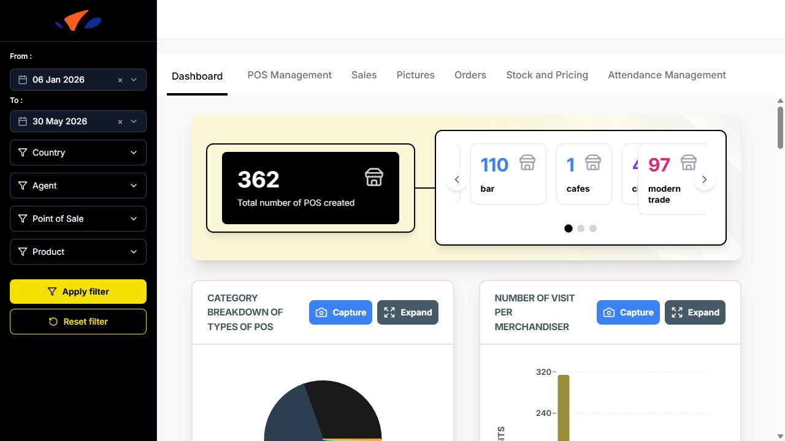

The dashboard is organised into several tabs: **Dashboard**, **POS Management**, **Sales**, **Pictures**, **Orders**, **Stock and Pricing**, and **Attendance Management**. A filter sidebar is available on the left side of each dashboard page.

Filters
-------

The dashboard uses a filter panel on the left side of the screen. The same filter panel is available across the dashboard pages.

The available filters are:

- **From**: start date of the reporting period.
- **To**: end date of the reporting period.
- **Country**: filter the dashboard by market.
- **Agent**: filter by merchandiser.
- **Point of Sale**: filter by a specific POS.
- **Product**: filter by SKU or product.

Click **Apply filter** to refresh the dashboard with the selected values. Click **Reset filter** to clear all selected filters and return to the default view.

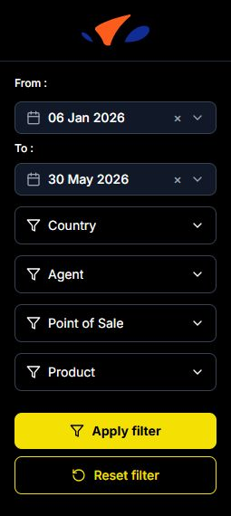

Dashboard Tab
-------------

The main dashboard displays key metrics:

- **Total number of POS created**
- **Category breakdown of types of POS** (bar, modern trade, hotel, restaurant, traditional trade, tavern, and other POS categories)
- **Number of visit per merchandiser** (bar chart)

- **POS Evolution Chart** (line chart showing POS creation over time)
- **POS created per Merchandiser** (searchable table with Rank, Merchandiser, and Number of PDVs created)

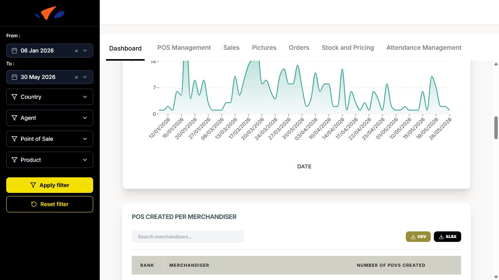

- **POS Channels Distribution** (pie chart: On Trade vs Off Trade)
- **List of merchandisers & number of POSs created** (bar chart)
- **Average number of competitor product per week and per country**
- **Activity by Person** (line chart showing visits over days for each merchandiser)

POC Management
--------------

This section allows you to manage and view all points of sale. You can switch between **Table view** and **Map view**.

- **Table view**: Lists all POCs with columns: POS Name, POS Owner, POS Channel, POS Type, Location, Geolocation, Heineken Available, Heineken unit price, and Created on. You can search using the **Rechercher** search bar.

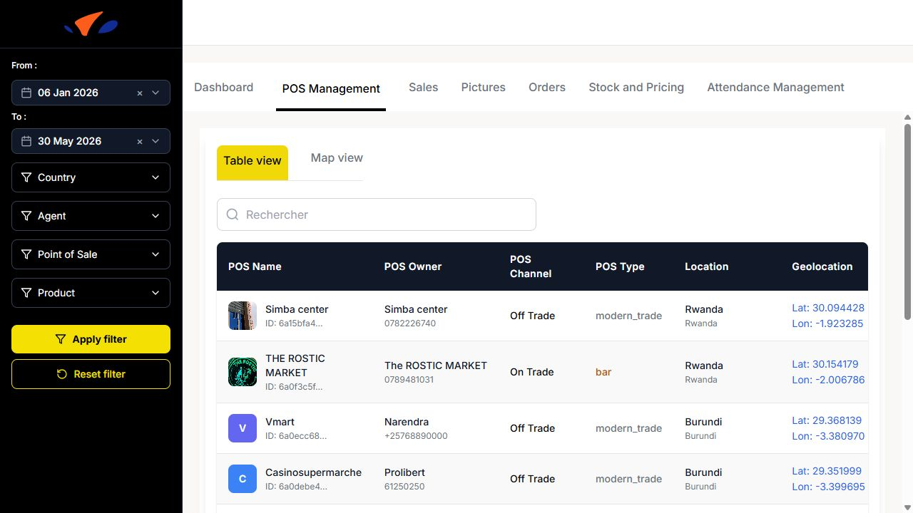

- **Map view**: Displays POC locations on a map.

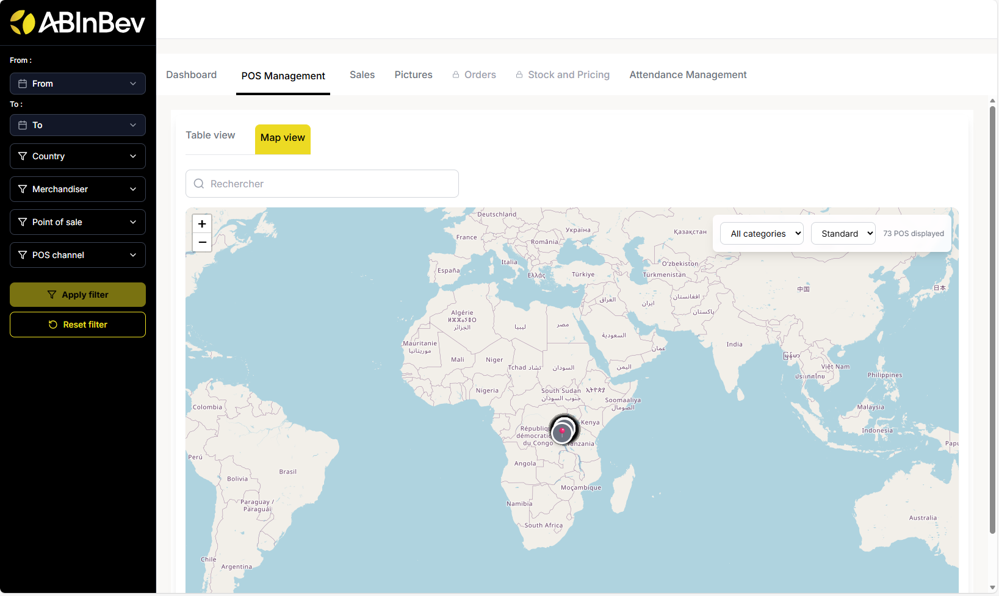

Sales
-----
The Sales tab shows sales performance:

- **Total sales** (sales amount from all visits)
- **Total Quantities** (total quantity sold during visits)
- **Sales per product** (bar chart showing total sales amount for each product)

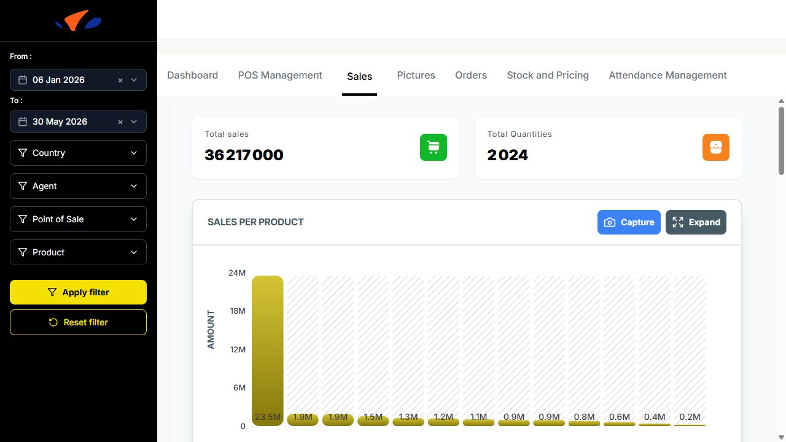

- **Sales per POS** (bar chart showing total sales amount for each point of sale)

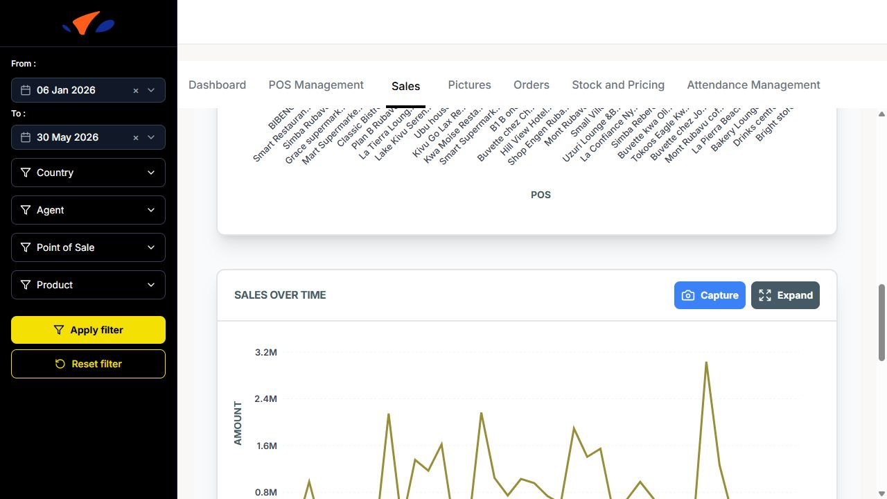

- **Sales over time** (line chart showing daily sales amount)
- **Sales per Month** (monthly sales trend)

Pictures
--------

This section displays photo cards for points of sale. Each card shows the POS image, channel (**On Trade** or **Off Trade**), country, initials, and POS name.

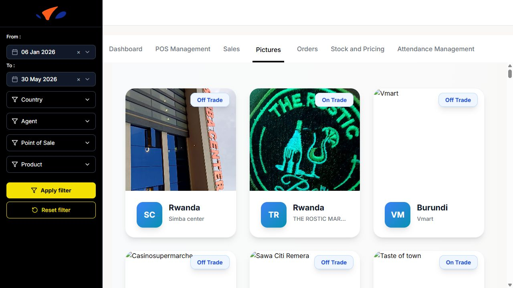

Orders
------

The **Orders** tab tracks orders and quantities submitted during visits. It is available at `https://kaeyros4abbev-dashboard.kaeyros.org/dashboard/orders`.

The top of the tab displays:

- **Number of Orders**
- **Average Orders per Day**
- **Total Quantities Ordered**

The tab includes the following charts:

- **Number of Orders / Agent**
- **Number of Orders / SKU**
- **Daily orders evolution**, with **Day**, **Week**, and **Month** views
- **Quantities / Agent**
- **Quantities / SKU**
- **Number of Rejections / Agent**
- **Number of Rejections / Reason**

The bottom table includes a **Search ...** field, **CSV** export, **XLSX** export, and **Columns** selector. If no rows match the current filters, the dashboard displays **No data available** and suggests checking back later or resetting filters.

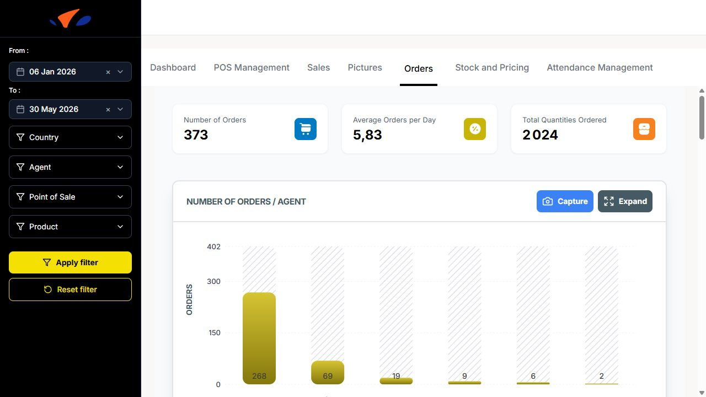

Stock and Pricing
-----------------

The **Stock and Pricing** tab tracks product availability, out-of-stock situations, POS alerts, and product price evolution. It is available at `https://kaeyros4abbev-dashboard.kaeyros.org/dashboard/stocks-pricing`.

Use the filters on the left side of the dashboard to refine the analysis by:

- **From / To** date range
- **Country**
- **Agent**
- **Point of Sale**
- **Product**

Click **Apply filter** to update the charts. Click **Reset filter** to clear the selected filters.

The top of the tab displays three key indicators:

- **Availability Rate (Numeric Distribution)**: percentage of product observations marked as available.
- **Out-of-Stock Rate (OOS Rate)**: percentage of product observations marked as out of stock.
- **Points of Sale on Alert**: number of POS with stock availability issues.

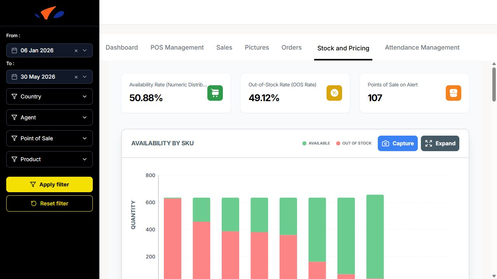

The **Availability by SKU** chart compares available quantity and out-of-stock quantity for each product. It helps identify which SKUs are most frequently unavailable.

The **Out of Stock per POS** chart ranks points of sale by the number of out-of-stock products. Use it to quickly identify POS that need follow-up.

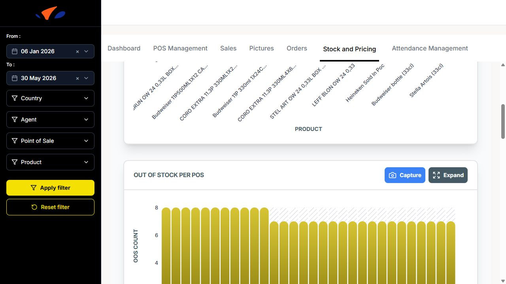

The **Average Prices Evolution** chart shows how average product prices evolve over time. The view can be switched between **Day**, **Week**, and **Month**.

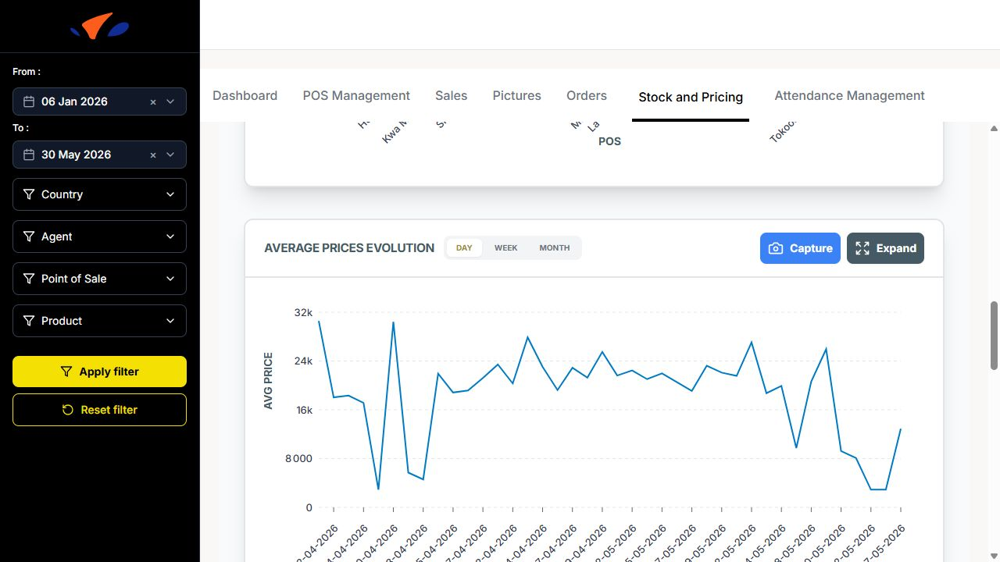

The **Prices evolution of products** chart compares price changes across selected products. The chart can display multiple products at the same time, making it easier to spot product-level price differences.

The **Out of Stock vs Sales Correlation** chart compares OOS count and sales volume over time. Use it to understand whether stock issues are affecting sales activity.

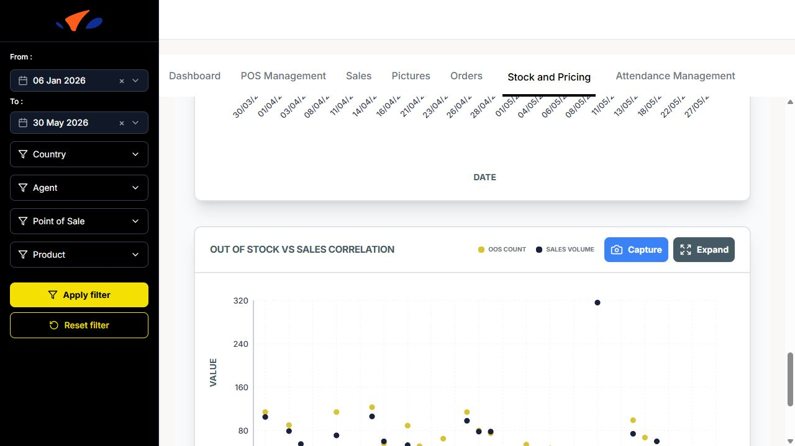

Attendance Management
---------------------

Monitor merchandiser attendance and work time:

- **Attendance summary**: number of present/absent merchandisers.
- **Summary of working time per user**: table with worktime categories such as **< 1 hour**, **1 to 2 hours**, **2 to 3 hours**, **3 to 4 hours**, **4 to 5 hours**, and **> 5 hours**.
- **Daily attendance summary**: chart showing attendance status for each day.

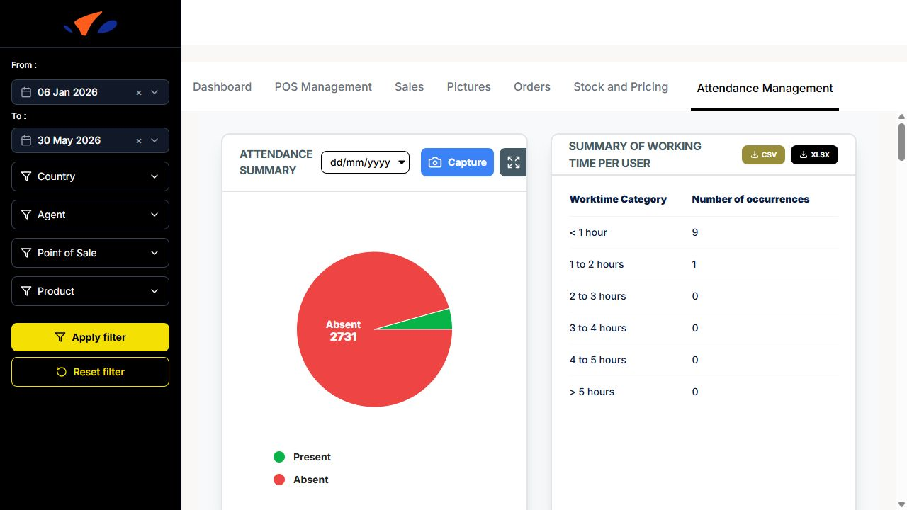

- **Attendance Tracking per Merchandisers**: chart grouped by time category.
- **Distribution of visits by time slots**: chart using **Early morning: 06:00 to 10:00**, **Late morning: 10:00 to 14:00**, and **Afternoon: 14:00 to 18:00**.

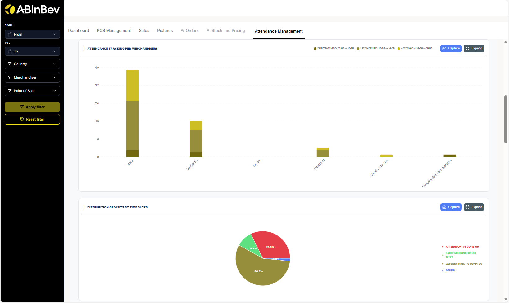

- **Distribution of visits per day**
- **Average number of visits per week and per agent**

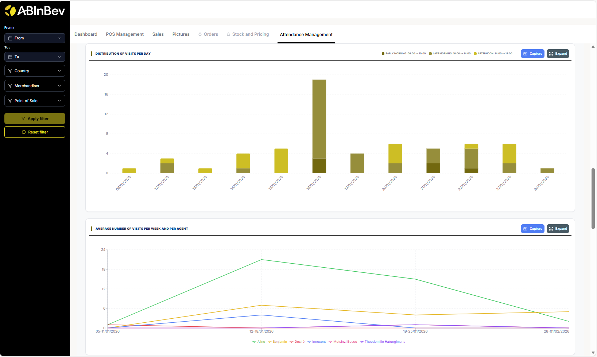

- **Distribution of visits per month**
- **Working time Report**: searchable table with Agent, Date, Country, Start Time, End Time, Total Work Time, and Work Time Rate. The table supports **CSV**, **XLSX**, and **Columns** controls.

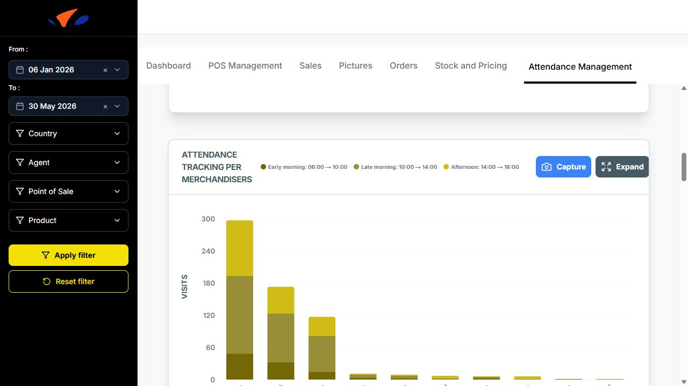

Export and Capture
------------------

Many sections have **Capture** and **Expand** buttons to take screenshots or enlarge charts for better viewing.
